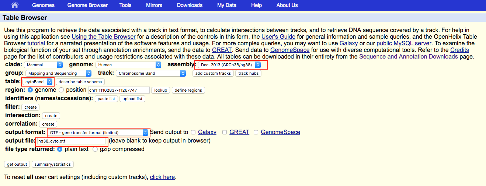

# Reference Annotations

How to build files related to specific reference genomes

```
# mkdir -p ucsc
# rsync -a -P rsync://hgdownload.soe.ucsc.edu/genome/admin/exe/macOSX.x86_64/ ./ucsc
```

## hg19

Download the chromosome list with sizes from UCSC.

```
wget http://hgdownload.soe.ucsc.edu/goldenPath/hg19/bigZips/hg19.chrom.sizes
```

Filter the chromosome list so that only complete chromosomes are present.

```python
sizes = dict(l.strip('\n').split('\t') for l in open('hg19.chrom.sizes', 'rU'))
with open('hg19.chrom_sizes.txt','w') as outh:
    for c in ['chr%d' % _ for _ in range(1,23)] + ['chrX', 'chrY']:
        print >>outh, '%s\t%s' % (c, sizes[c])

```

Download locations of the cytogenetic bands from UCSC.

Sort the GTF according to our order above.

```bash
../tools/sortgtf.py --chroms hg19.chrom_sizes.txt < hg19_cyto.gtf > hg19.cytoband.gtf

```

### TODO: include how to obtain other references used for comparison

Clean up:

```
rm -f hg19_cyto.gtf hg19.chrom.sizes
```

## hg38

Download the chromosome list with sizes from UCSC.

```
wget http://hgdownload.soe.ucsc.edu/goldenPath/hg38/bigZips/hg38.chrom.sizes
```

Sort the chromosome list so that complete chromosomes come first, then alternate haplotypes, then random sequences, then unplaced contigs.

```python
import re
sizes = dict(l.strip('\n').split('\t') for l in open('hg38.chrom.sizes', 'rU'))
sortord = map(str, range(1,23)) + ['X', 'Y', 'Un', 'M' ]
sortord = {'chr%s' %s : i for i,s in enumerate(sortord)}
rxs = [
    re.compile('chr\d?[XY\d]$'),
    re.compile('_alt$'),
    re.compile('_random$'),
    re.compile('')
]

with open('hg38.chrom_sizes.txt', 'w') as outh:
    for rx in rxs:
        ks = sorted(k for k in sizes.keys() if rx.search(k))
        ks.sort(key=lambda x:sortord[x.split('_')[0]])
        for c in ks:
            print >>outh, '%s\t%s' % (c, sizes.pop(c))

```

Download locations of the cytogenetic bands from UCSC.



Sort the table.

```
../tools/sortgtf.py --chroms hg38.chrom_sizes.txt < hg38_cyto.gtf > hg38.cytoband.gtf
```


Clean up:

```
rm -f hg38_cyto.gtf hg38.chrom.sizes
```
